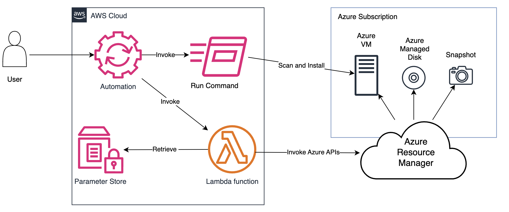
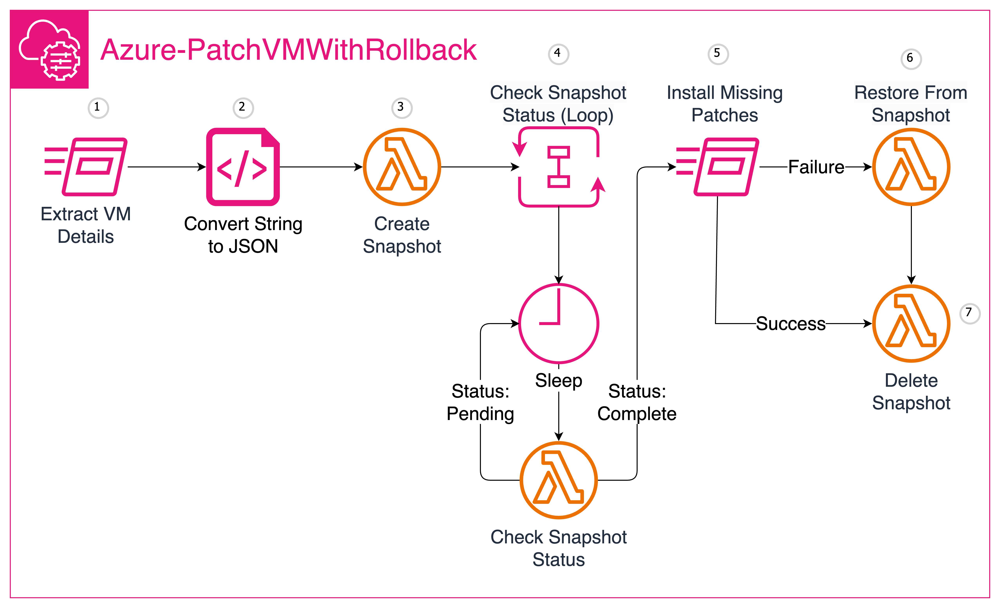
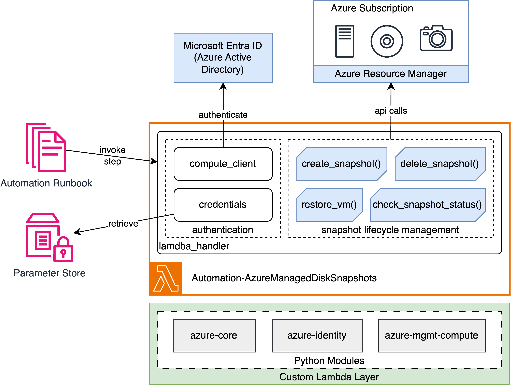

# Automate your Multicloud operations with AWS Systems Manager and AWS Lambda

This repo hosts templates written for the AWS Blog Post "[Automate your Multicloud operations with AWS Systems Manager and AWS Lambda](https://aws.amazon.com/blogs/mt/automate-your-multicloud-operations-with-aws-systems-manager-and-aws-lambda/)" published on the [AWS Cloud Operations & Migrations](https://aws.amazon.com/blogs/mt/) blog channel.

## Overview

The solution demonstrates how to leverage AWS Systems Manager's Automation capabilities to automate operational tasks on multi cloud resources. The solution combines Systems Manager Automation runbooks with AWS Lambda functions to interact with the Azure Resource Manager APIs, enabling centralized management and automation across AWS and Azure environments.

To demonstrate the solution, we will replicate the functionality of the [AWS-PatchInstanceWithRollback](https://docs.aws.amazon.com/systems-manager-automation-runbooks/latest/userguide/automation-aws-patchinstancewithrollback.html) Automation runbook to patch Azure VMs with the same safeguard of rolling back the root disk to a known working state from an [Azure Managed Disk Snapshot](https://learn.microsoft.com/en-us/azure/virtual-machines/snapshot-copy-managed-disk?tabs=portal) as shown below.

## Solution Description

This solution creates two new resources:

1. Automation runbook - **Azure-PatchVMWithRollback** 
2. Lambda Function - **AzureManagedDiskSnapshots**.

The **Azure-PatchVMWithRollback** runbook owns the end-to-end workflow of the Automation and controls the behavior of the Lambda Function, passing data about the Azure Virtual Machine and the operation it must perform at each invocation. The **AzureManagedDiskSnapshots** Lambda Function, creates the bridge between Systems Manager and Azure Resource Manager enabling the runbook to execute the steps necessary to manage the lifecycle of the Azure Managed Disk Snapshots.

### Azure-PatchVMWithRollback Automation Runbook

The **Azure-PatchVMWithRollback** runbook uses a combination of the `Run Command`, `executeScript`, `Loop`, `Sleep`, `Branch` and `InvokeLambdaFunction` actions to execute the steps in the workflow.

1. **Extract VM Details:** Retrieve the hostname, root volume name, resource group, and subscription ID from the Azure VM's metadata service using a PowerShell or Bash script.
2. **Convert to JSON:** Convert the retrieved VM metadata into JSON format using a Python script.
3. **Create Snapshot:** Create a snapshot of the VM's root volume by invoking a Lambda function with the VM details in JSON format.
4. **Check Snapshot Status:** Using Loop and Sleep automation actions, monitors the snapshot creation process by periodically invoking the Lambda function to check the snapshot status until it's complete.
5. **Install Missing Patches:** Invoke RunCommand to install any missing patches required by the Security Patch Baseline.
6. **Delete Snapshot (OnSuccess):** If the patch installation is successful, invoke the Lambda function to delete the root volume snapshot.
7. **Restore from Snapshot (OnFailure):** If the patch installation fails, invoke the Lambda function to restore the VM to its previous state using the snapshot, and then delete the snapshot.

### AzureManagedDiskSnapshots Lambda Function

The **AzureManagedDiskSnapshots** Lambda Function uses a custom Lambda layer populated with the Azure python modules to interact with the Azure Resource Manager APIs and help reduce the execution time.

The Lambda Function retrieves credentials from Parameter Store, authenticates with **Microsoft Entra ID** and performs the `create`, `delete`, `check status` and `restore` actions to manage the lifecycle of the Azure Managed Disk Snapshot.

## Deployment

### Prerequisites

To deploy the application to AWS you need the following:

1. An AWS account.
2. An Azure account subscription with [Owner](https://learn.microsoft.com/en-us/azure/role-based-access-control/built-in-roles) role.
3. An Azure VM managed by Systems Manager as Hybrid Managed node. To learn more, please see [Quickstart: Create a Linux virtual machine in the Azure portal](https://learn.microsoft.com/en-us/azure/virtual-machines/linux/quick-create-portal?tabs=ubuntu) and [Setting up Systems Manager for hybrid and multicloud environments.](https://docs.aws.amazon.com/systems-manager/latest/userguide/systems-manager-managedinstances.html)

### Getting Started

Setup Instructions are divided into two sections:

#### Azure Setup

1. Creating the Azure App registration in the [Microsoft Entra ID portal](https://entra.microsoft.com/).
2. Granting necessary permissions to Azure subscription for Lambda function to manage the Azure VMs in your Resource Group.

#### AWS Setup

1. Storing the Azure App registration credentials securely in the Parameter Store.
2. Preparing and uploading the Azure python module package to [Amazon S3](https://aws.amazon.com/s3/). This S3 bucket will be passed as input to CFN template in the next step to prepare custom lambda layer.
3. Deploying the [Cloudformation](./Resources/Cfn-Deploy-Azure-PatchVMWithRollback.yml) template to provision **Azure-PatchVMWithRollback** runbook and **AzureManagedDiskSnapshots** Lambda Function.

For the detailed instructions of deploying above steps, please follow the [Solution Deployment]() section of the blog.

## Security

See [CONTRIBUTING](CONTRIBUTING.md#security-issue-notifications) for more information.

## License

This library is licensed under the MIT-0 License. See the LICENSE file.

